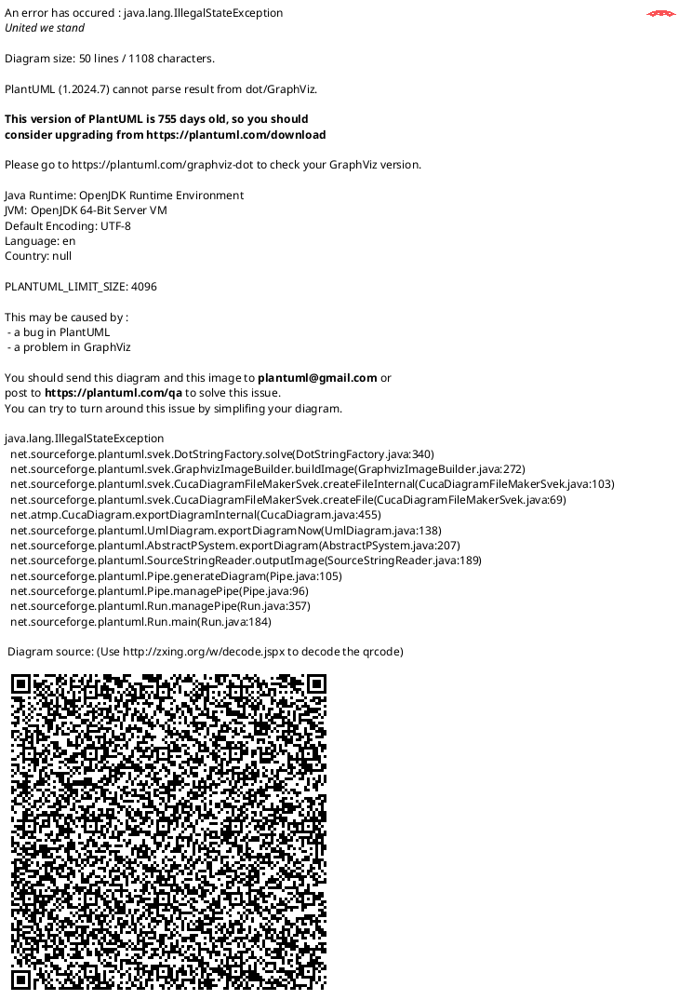
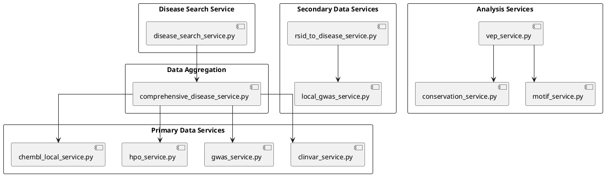
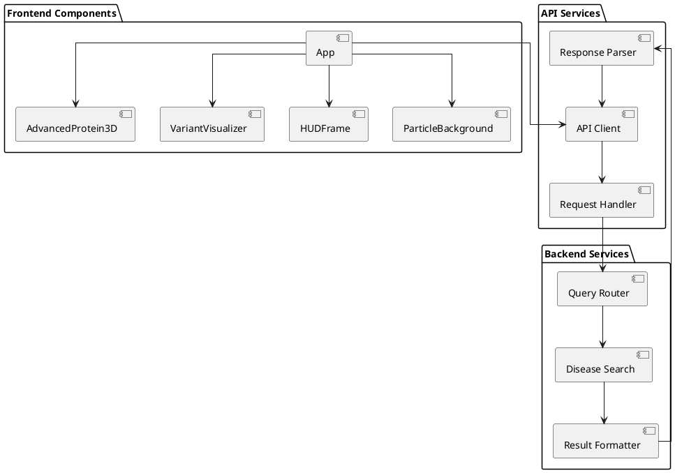
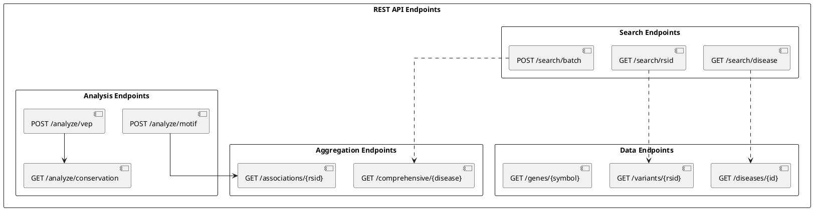
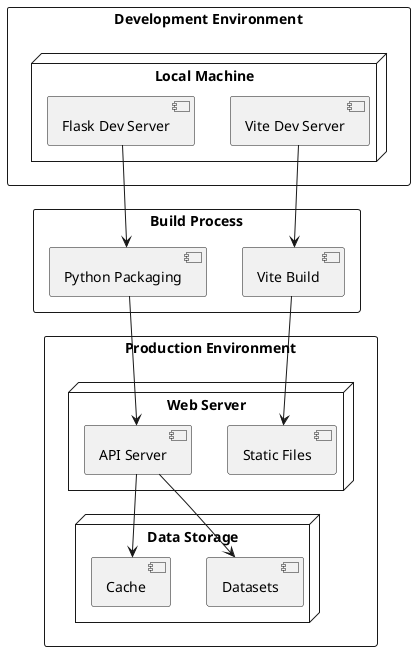
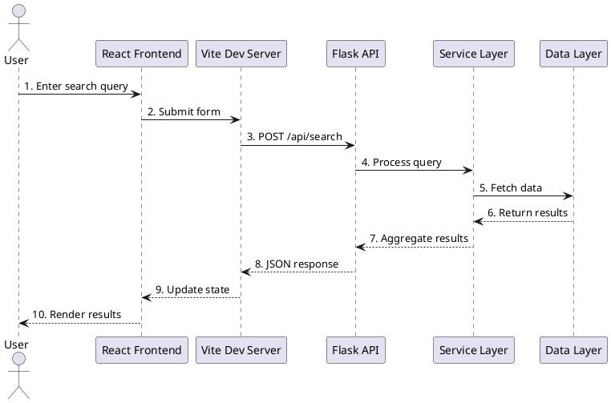
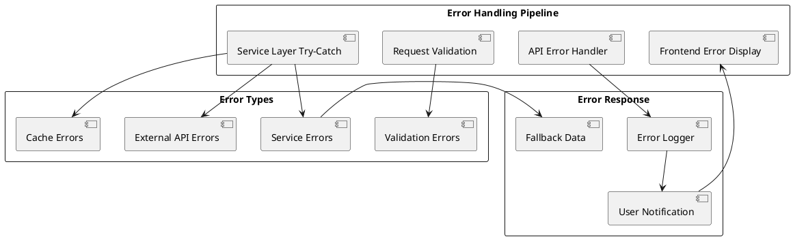

# Project Structure and Architecture Documentation

## Table of Contents
1. [File Structure Overview](#file-structure-overview)
2. [Directory Organization](#directory-organization)
3. [Architecture Diagrams](#architecture-diagrams)
4. [Component Relationships](#component-relationships)
5. [Data Flow](#data-flow)
6. [Module Dependencies](#module-dependencies)

---

## File Structure Overview

```
genomic-disease-search/
├── app/                              # Backend Python Flask application
│   ├── main.py                      # Flask app entry point
│   ├── models.py                    # Data models
│   ├── __init__.py                  # Package initialization
│   └── services/                    # Business logic services
│       ├── __init__.py
│       ├── chembl_local_service.py          # ChEMBL drug data service
│       ├── clinvar_service.py               # ClinVar variant service
│       ├── comprehensive_disease_service.py # Disease aggregation
│       ├── conservation_service.py          # Conservation scoring
│       ├── disease_search_service.py        # Disease search engine
│       ├── gwas_service.py                  # GWAS association service
│       ├── hpo_service.py                   # HPO phenotype service
│       ├── local_gwas_service.py            # Local GWAS data service
│       ├── motif_service.py                 # Motif analysis service
│       ├── rsid_to_disease_service.py       # RSID resolution service
│       └── vep_service.py                   # VEP annotation service
│
├── src/                              # Frontend React/Vite application
│   ├── main.jsx                     # React entry point
│   ├── App.jsx                      # Main App component
│   ├── App.css                      # App styling
│   ├── index.css                    # Global styles
│   ├── assets/                      # Static assets
│   │   ├── hero.png
│   │   ├── react.svg
│   │   └── vite.svg
│   ├── components/                  # React components
│   │   ├── AdvancedProtein3D.jsx           # 3D protein visualization
│   │   ├── HUDFrame.jsx                   # UI frame component
│   │   ├── ParticleBackground.jsx         # Animated background
│   │   └── VariantVisualizer.jsx          # Variant visualization
│   └── services/
│       └── api.js                   # API client service
│
├── data/                            # Data storage and caching
│   ├── cache/                       # Cached API responses
│   ├── datasets/                    # Reference datasets
│   │   ├── chembl/
│   │   │   ├── chembl.csv
│   │   │   └── chembl_compounds.csv
│   │   ├── clinvar/
│   │   │   ├── clinvar.vcf
│   │   │   ├── clinvar_conflicting.csv
│   │   │   ├── disease_names.tsv
│   │   │   └── gwas-catalog-download-associations-v1.0-full.tsv
│   │   ├── hpo/
│   │   │   └── genes_to_phenotype.csv
│   │   └── reference/
│   │       ├── gencode.v50.annotation.gff3
│   │       ├── gencode.v50.chr_patch_hapl_scaff.annotation.gff3
│   │       └── humangenome.tsv
│   └── README.md
│
├── tests/                           # Test suite directory
├── public/                          # Public assets
│   ├── favicon.svg
│   └── icons.svg
├── docs/                            # Documentation
│   ├── README.md
│   ├── START_HERE.md
│   ├── DATASETS_GUIDE.md
│   ├── DISEASE_SEARCH_GUIDE.md
│   ├── GWAS_QUICK_GUIDE.md
│   └── [Additional documentation files...]
│
├── dist/                            # Built frontend distribution
├── node_modules/                    # NPM dependencies
├── .venv/                           # Python virtual environment
├── .vscode/                         # VS Code settings
│
├── Configuration Files:
├── package.json                     # Node.js dependencies and scripts
├── package-lock.json                # Locked Node.js versions
├── vite.config.js                   # Vite build configuration
├── tailwind.config.js               # Tailwind CSS configuration
├── postcss.config.cjs                # PostCSS configuration
├── eslint.config.js                 # ESLint configuration
├── requirements.txt                 # Python dependencies
├── .env.local                       # Environment variables
├── .gitignore                       # Git ignore rules
│
├── Root Files:
├── README_DISEASE_SEARCH.md         # Main disease search documentation
├── rest-api-doc.yaml                # REST API documentation
├── GITHUB_REPO_INFO.md              # GitHub repository info
├── DATASETS_READY.txt               # Dataset readiness marker
├── index.html                       # HTML entry point
├── server_out.log                   # Server output logs
└── server_err.log                   # Server error logs
```

---

## Directory Organization

### Backend Structure (Python/Flask)
```
app/
├── Responsibility: Core backend logic and API endpoints
├── models.py: Data models and database schemas
└── services/: Business logic layer
    ├── Search Services: disease_search_service, rsid_to_disease_service
    ├── Data Services: chembl_local_service, clinvar_service, gwas_service, hpo_service
    ├── Analysis Services: vep_service, conservation_service, motif_service
    └── Aggregation: comprehensive_disease_service
```

### Frontend Structure (React/Vite)
```
src/
├── Responsibility: User interface and client-side logic
├── App.jsx: Main application wrapper
├── components/: Reusable React components
│   ├── Visualization: AdvancedProtein3D, VariantVisualizer
│   ├── UI Layout: HUDFrame
│   └── Effects: ParticleBackground
└── services/: Client-side utilities
    └── api.js: Backend API communication layer
```

### Data Management
```
data/
├── cache/: Runtime cache for API responses
└── datasets/: Reference data collections
    ├── chembl/: Drug-compound mappings
    ├── clinvar/: Clinical variant annotations
    ├── hpo/: Human phenotype ontology
    └── reference/: Genomic reference sequences
```

---

## Architecture Diagrams

### 1. System Architecture Overview



### 2. Service Layer Architecture



### 3. Data Flow Architecture

```plantuml
@startuml data-flow
!define FONTAWESOME https://raw.githubusercontent.com/tupadr3/font-awesome-plantuml/master
!include FONTAWESOME/common.puml
!include FONTAWESOME/database.puml

actor User as user

rectangle "Frontend" {
  component [React UI] as UI
}

rectangle "API Layer" {
  component [Flask REST API] as API
}

rectangle "Processing Layer" {
  component [Search Engine] as Search
  component [Data Aggregator] as Aggregator
  component [Analyzers] as Analyzers
}

rectangle "Data Sources" {
  database [Local Cache] as LocalCache
  database [Reference Data] as RefData
  component [External APIs] as ExtAPI
}

user --> UI : User Input
UI --> API : HTTP Request
API --> Search : Parse Query
Search --> Aggregator : Forward Query
Aggregator --> RefData : Fetch Data
Aggregator --> LocalCache : Check Cache
Aggregator --> ExtAPI : API Call if needed
Analyzers --> RefData : Annotation
Analyzers --> ExtAPI : External Analysis
Analyzers --> LocalCache : Store Results
API --> UI : JSON Response
UI --> user : Display Results

@enduml
```

### 4. Component Interaction Diagram



### 5. Database and Data Models

```plantuml
@startuml data-models
!define FONTAWESOME https://raw.githubusercontent.com/tupadr3/font-awesome-plantuml/master
!include FONTAWESOME/database.puml

entity "Disease" as Disease {
  *id : UUID
  --
  name : string
  description : text
  omim_id : string
  icd10_code : string
  synonyms : array
  created_at : timestamp
}

entity "Variant" as Variant {
  *id : UUID
  --
  rsid : string
  chromosome : integer
  position : long
  ref_allele : string
  alt_allele : string
  clinical_significance : enum
  created_at : timestamp
}

entity "Gene" as Gene {
  *id : UUID
  --
  symbol : string
  ensembl_id : string
  ncbi_id : integer
  chromosome : string
  start_pos : long
  end_pos : long
  created_at : timestamp
}

entity "DiseaseVariantAssociation" as DVA {
  *id : UUID
  --
  disease_id : UUID
  variant_id : UUID
  evidence_score : float
  source : enum
  created_at : timestamp
}

entity "GeneVariantAssociation" as GVA {
  *id : UUID
  --
  gene_id : UUID
  variant_id : UUID
  impact : enum
  consequence : string
  created_at : timestamp
}

Disease ||--o{ DVA : has
Variant ||--o{ DVA : associated_with
Variant ||--o{ GVA : affects
Gene ||--o{ GVA : contains

@enduml
```

### 6. API Endpoint Architecture



### 7. Deployment Architecture



### 8. Technology Stack

```plantuml
@startuml tech-stack
!define FONTAWESOME https://raw.githubusercontent.com/tupadr3/font-awesome-plantuml/master
!include FONTAWESOME/common.puml

rectangle "Frontend Stack" {
  component [React 18] as React
  component [Vite] as Vite
  component [Tailwind CSS] as Tailwind
  component [Three.js (3D)] as ThreeJS
}

rectangle "Backend Stack" {
  component [Python 3.x] as Python
  component [Flask] as Flask
  component [BioPython] as BioPython
}

rectangle "Data Stack" {
  database [CSV/TSV] as CSV
  database [VCF] as VCF
  database [GFF3] as GFF
}

rectangle "External Services" {
  component [ChEMBL API] as ChEMBLAPI
  component [ClinVar] as ClinVarAPI
  component [GWAS Catalog] as GWASCatalog
  component [HPO] as HPOAPI
  component [VEP] as VEPAPI
}

Vite --> React
React --> Tailwind
React --> ThreeJS
Flask --> Python
Python --> BioPython
Python --> CSV
Python --> VCF
Python --> GFF
Flask --> ChEMBLAPI
Flask --> ClinVarAPI
Flask --> GWASCatalog
Flask --> HPOAPI
Flask --> VEPAPI

@enduml
```

### 9. Request/Response Flow



### 10. Error Handling Flow



---

## Component Relationships

### Service Dependencies
```
disease_search_service.py
├── depends on: comprehensive_disease_service.py
├── depends on: local_gwas_service.py
└── depends on: rsid_to_disease_service.py

comprehensive_disease_service.py
├── depends on: clinvar_service.py
├── depends on: gwas_service.py
├── depends on: hpo_service.py
└── depends on: chembl_local_service.py

vep_service.py
├── depends on: conservation_service.py
└── depends on: motif_service.py
```

### Frontend Component Dependencies
```
App.jsx
├── imports: HUDFrame
├── imports: AdvancedProtein3D
├── imports: VariantVisualizer
├── imports: ParticleBackground
└── imports: api.js

api.js
├── exports: HTTP client methods
└── configures: Backend endpoint URLs
```

---

## Data Flow

### Disease Search Query Flow
```
User Input (Disease Name)
    ↓
React Component (App.jsx)
    ↓
API Client (api.js)
    ↓
Flask Route Handler (main.py)
    ↓
disease_search_service.py
    ↓
comprehensive_disease_service.py
    ↓
[clinvar_service, gwas_service, hpo_service, chembl_local_service]
    ↓
Local Cache / Reference Data
    ↓
Result Aggregation & Formatting
    ↓
JSON Response → Frontend
    ↓
React Components Display Results
```

### RSID to Disease Flow
```
User Input (RSID)
    ↓
rsid_to_disease_service.py
    ↓
local_gwas_service.py
    ↓
gwas_service.py
    ↓
clinvar_service.py
    ↓
Disease Information & Associations
    ↓
Result Formatting
    ↓
JSON Response → Frontend
```

---

## Module Dependencies

### Python Backend Dependencies
```
requirements.txt
├── Flask (REST API framework)
├── BioPython (Sequence analysis)
├── pandas (Data manipulation)
├── requests (HTTP client)
├── numpy (Numerical computation)
└── [Additional scientific libraries]
```

### Node.js Frontend Dependencies
```
package.json
├── react (UI library)
├── vite (Build tool)
├── tailwindcss (Styling)
├── three.js (3D graphics)
├── axios (HTTP client)
└── [Additional packages]
```

---

## Key Architectural Principles

1. **Separation of Concerns**: Frontend, API, services, and data layers are clearly separated
2. **Service-Oriented Architecture**: Business logic organized into focused, reusable services
3. **Caching Strategy**: Local cache reduces external API calls
4. **Modular Components**: React components are self-contained and reusable
5. **Data Aggregation**: Comprehensive service consolidates data from multiple sources
6. **Error Handling**: Multiple layers of error handling and validation
7. **API-First Design**: REST API serves as contract between frontend and backend

---

## File Naming Conventions

- **Services**: `{domain}_service.py` (e.g., `clinvar_service.py`)
- **Components**: `PascalCase.jsx` (e.g., `AdvancedProtein3D.jsx`)
- **Utilities**: `camelCase.js` (e.g., `api.js`)
- **Data files**: `lowercase_with_underscores` (e.g., `genes_to_phenotype.csv`)
- **Config files**: Standard names (e.g., `vite.config.js`, `tailwind.config.js`)

---

## Environment Setup

### Frontend
- Built with: React + Vite
- Styling: Tailwind CSS
- Build output: `dist/`
- Development server: `npm run dev`

### Backend
- Framework: Flask (Python)
- Entry point: `app/main.py`
- Environment: Python virtual environment (`.venv/`)
- Dependencies: `requirements.txt`

### Data
- Cache location: `data/cache/`
- Reference datasets: `data/datasets/`
- Supported formats: CSV, TSV, VCF, GFF3

---

## Documentation Index

- **START_HERE.md**: Quick start guide
- **DATASETS_GUIDE.md**: Data setup instructions
- **DISEASE_SEARCH_GUIDE.md**: Feature documentation
- **GWAS_QUICK_GUIDE.md**: GWAS module guide
- **rest-api-doc.yaml**: OpenAPI specification
- **HOW_TO_RUN.md**: Execution instructions

